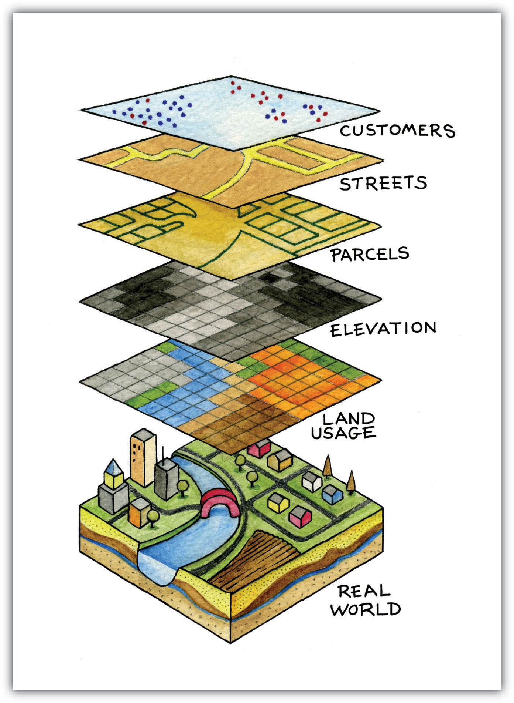

# Digital Mapping Workshop

Welcome to the workshop. We're talking about digital mapping today. No experience required.

We'll be cover three straightforward questions: what is digital mapping?, why might you want to map?, and how can you get started?

**But first, a map...**

<iframe width="100%" height="520" frameborder="0" src="https://djstory.carto.com/builder/9559767b-a51c-4582-8822-e2e6c55101fe/embed" allowfullscreen webkitallowfullscreen mozallowfullscreen oallowfullscreen msallowfullscreen></iframe>

## What is Digital Mapping?

### Some Basics

* By *digital mapping* I mean **GIS**
  * Geographic Information Science/Systems
* Ususually 1 or more sets of spatial data layered on top of a basemap

### Vector Data

* Points

* Lines

* Polygons

  

### Raster Data

Raster data as akin to laying a grid over the landscape. Each of the squares in the grid can hold a single value—in the example below, it is a numeric code representing different geographic area types.

The *size* of the squares will determine how closely the map matches the real world that it is representing.

### Layering It All Together

Digital maps are usually made up of one or more layers of spatial data (vector, raster, or both) on top of some kind of basemap (which itself is just another layer of spatial data).

## Why Might You Want to Map?

### First things first: research questions, then methods, then tools!!!

Methods change much less frequently than tools do...

### Some Reasons to Map

* To expose and explore geographic patterns in your data
  * Clusters and gaps
  * Changes over time
* To juxtapose/overlay two or more datasets
* To bring a map image into digital space (i.e. a scan of a historic map), a process called *georectification*
* To present and share you research—on the web, in a talk, in print
* Develop a skill that is in high demand both within academia and outsideAny one method has its affordances, and its limitsElection map example of how geographic representation distorts

### Of course, all methods have their affordances *and their limits*

## OK—Now How Can You Get Started?

### Get Your Data Ready

* For many of us, that means structuring data in a spreadsheet, like this for example
  * If you have a large dataset you want to map, start with a meaningful subset of that data
* Then load that structured data into a GIS tool—most tools will automatically apply a procedure known as *geocoding*, which assigns lattitude and longitude points to your place names
* You might also go looking for other spatial data to compliment what you have, such as political boundaries, census stats, or transit routes
* Alternatively, you might need to create your dataset right in the GIS tool, by plotting points, drawing lines, or outlining areas

### Pick Your Tool

* Desktop tools
* Web-based tools
* Tools for thinking about styling your map

## Workshop Materials

* [Presentation Slides](https://iu.box.com/s/bvbdsjqmx4cdcip320upvzp0i44ykth9) (PDF)
* [Activity 1](activity1.md): Assess 3 example digital edition sites.
* [Activity 2](activity2.md): Conduct document analysis.
* [Activity 3](activity3.md): Encode following the TEI Guidelines.
* [Activity 4](activity4.md): Publish with TEI Boilerplate; compare publishing platforms. 
* [Activity 5](activity5.md): Publish with TEI Boilerplate; optional exercise that can be completed post-workshop. 

## Further Resources

- [Electronic Texts: Audiences and Purposes](http://www.digitalhumanities.org/companion/view?docId=blackwell/9781405103213/9781405103213.xml&chunk.id=ss1-3-6&toc.depth=1&toc.id=ss1-3-6&brand=9781405103213_brand) by Perry Willett in A Companion to Digital Humanities (2004)

## 

## Contact

* Daniel Story, Digital Scholarship Librarian, University of California, Santa Cruz
* Website: [digitalscholarship.ucsc.edu](http://digitalscholarship.ucsc.edu)
* Email: [dstory@ucsc.edu](mailto:dstory@ucsc.edu) 
* Twitter: @danieljstory
